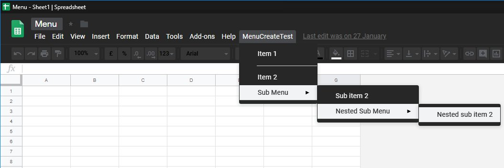

Create menu easily with array of items  

``` js  

	var _Menu = new Menu();  

	var items = [  
		['Item 1', 'menuTestFunction'],  // menu item ['label', 'calledFunction']  
		'-',                             // dash is separator  
		['Item 2', 'menuTestFunction'],  
		{  							    // object is submenu, key is label  
			'Sub Menu':  
			[  
				['Sub item 2', 'menuTestFunction'],  
				{'Nested Sub Menu':  
					[  
						['Nested sub item 2', 'menuTestFunction']  
					]  
				}  
			]  
		},  
	];  

	_Menu.create('MenuCreateTest', items);  

```  
  